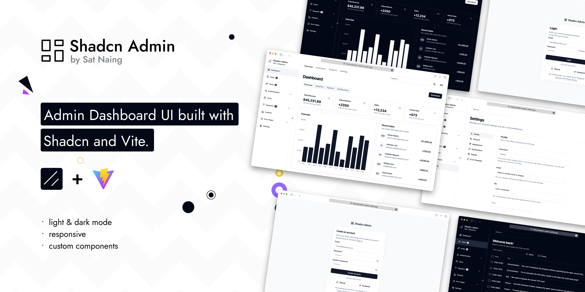

# Shadcn Admin Dashboard

Admin Dashboard UI crafted with Shadcn and Vite. Built with responsiveness and accessibility in mind.



I've been creating dashboard UIs at work and for my personal projects. I always wanted to make a reusable collection of dashboard UI for future projects; and here it is now. While I've created a few custom components, some of the code is directly adapted from ShadcnUI examples.

> This is not a starter project (template) though. I'll probably make one in the future.

## Features

- Light/dark mode
- Responsive
- Accessible
- Sidebar and header layouts
- 10+ pages
- Extra custom components

## Tech Stack

**UI:** [ShadcnUI](https://ui.shadcn.com) (TailwindCSS + RadixUI)

**Build Tool:** [Vite](https://vitejs.dev/)

**Routing:** [React Router](https://reactrouter.com/en/main)

**Type Checking:** [TypeScript](https://www.typescriptlang.org/)

**Linting/Formatting:** [Eslint](https://eslint.org/) & [Prettier](https://prettier.io/)

**Icons:** [Tabler Icons](https://tabler.io/icons)

## Run Locally

Clone the project

```bash
  git clone https://github.com/satnaing/shadcn-admin.git
```

Go to the project directory

```bash
  cd shadcn-admin
```

Install dependencies

```bash
  pnpm install
```

Start the server

```bash
  pnpm run dev
```

<!-- ## Author

Crafted with 🤍 by [@satnaing](https://github.com/satnaing)

## License

Licensed under the [MIT License](https://choosealicense.com/licenses/mit/)
 -->


add column to sql server 

ALTER TABLE dbo.Users 
ADD 
	UserId VARCHAR(50) NULL, 
	EmployeeId VARCHAR(50) NULL, 
	Province VARCHAR(50) NULL,
	Zipcode VARCHAR(50) NULL, 
	Country VARCHAR(50) NULL,
	IdCard VARCHAR(50) NULL, 
	DateOfBirth date NULL, 
	DateOfHire date NULL,
	Division VARCHAR(50) NULL, 
	Status VARCHAR(50) NULL
;
GO

// Modify datatype
ALTER TABLE dbo.Company
ALTER COLUMN BillCountry nvarchar(max) null


GO


 


